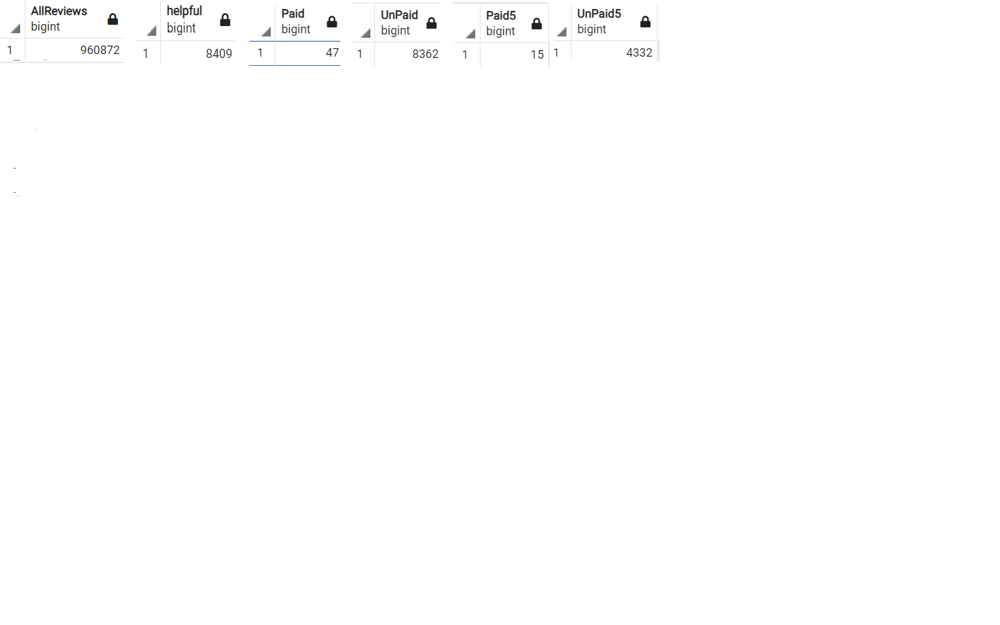
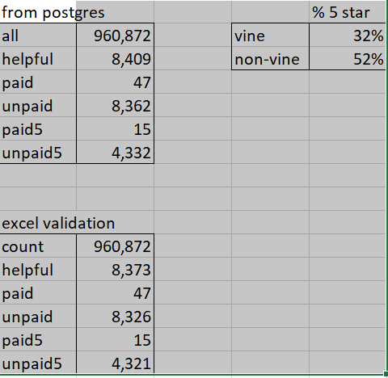

# Amazon_Vine_Analysis
## Purpose of the Analysis

The Vine program offers vendors an opportunity to get reviews quickly. This comes at the cost of distributing paid samples and paying a fee to Amazon. It may be worth it, especially as a new market participant, to gain some attention, but does it also (unfairly and or opportunistically) get you higher ratings?

This study was based on sample reviews of watches provided by Amazon to support studies such as this and to support aspiring data scientists in their studies.

## Methodology

This study provides a comparison of paid (Vine) and non-paid reviews, looking to see if paids draw a higher percentage of 5-start reviews than non-paid results.

# Setting up the study

I stored the data for this study on Amazon Web Services, and linked this to a postgres instance on my laptop. I used Spark in a google collab environment to extract, transform and load the data to the database.

# analyzing the results

One I had the data set up, I copied the relavent data to my laptop, and established a local postres database to pull the necessary values. I also spot checked my work in Excel, and saw comperable results.

The SQL code is attached in this link: [sql_code](Vine_Review_Analysis.sql)

The outputs from the SQL runs are shown here, and also included as comments in the code.

In these numbers, 
- all is the total of all prodcuts reviewed
- helpful is reviews where there are > 20 reviews, and over 1/2 of them have been tagged "helpful"
- paid is the subset of the above in the Vine program
- unpaid is the amount not in the Vine program
- paid5 is the number of the number of paid that get 5 starts
- unpaid is the number of unpaid that got 5 starts

## Results:

In short, participating in the Vine program does not appear to yield more 5-start ratings. We see that 32% of Vine products receive a five star ratings, which is less than the 52% of non-Vine products achieving this rating.

## for further study

# look at other product categories
The numbers of Vine reviews in this set is too small to draw solid conclusions, and the product class (watches) might not draw a good sample of Amazon consumers - watches are subject to prestige buying, either to show success (e.g. rolex) or to show athletic ambitions (e.g. ironman watches) as more and more people forgo watches and use their phones to see the time.

# differences between emerging and established vendors
The Vine program may be more heavily used by new vendors trying to attract attention and break into the market. It is possible that these newer entries may have less established manufacturing and maybe novel product ideas that don't immediately catch on with their users. It would be interesting to compare multiple products from the same manufacturer to get better comperability between the Vine and non-Vine products.

